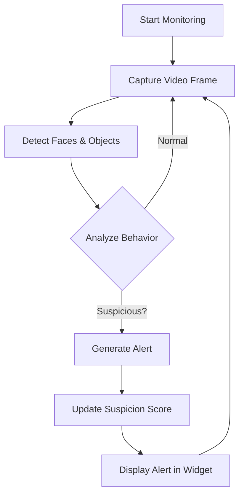

# AI Interview Proctor

A sophisticated, real-time proctoring tool designed as a browser extension for **interviewers**. It integrates directly into Google Meet and Zoom to automatically detect and flag potential cheating behaviors from the candidate's video feed.


## 🔄 Workflow



## ✨ Core Features

### Interviewer-Focused

- Analyzes the candidate's video stream from the interviewer's machine

### Live Cheating Detection

- Pipeline of AI models for real-time suspicious activity detection

### Advanced Tracking

- Face & Gaze Tracking (MediaPipe)
- Enhanced Eye Gaze Detection
- Suspicious Object Detection (YOLOv5)
- Multiple Face Detection

### Behavioral Analysis

- Real-time suspicion scoring (0-100)
- Pattern analysis over time
- Contextual event descriptions (Microsoft GIT)

### User-Friendly Alerts

- Color-coded by severity
- Discreet on-screen widget
- No disruption to interview flow

### Privacy-Focused

- Fully local processing
- No external API keys required
- No subscription costs

## Quick Start

### Prerequisites

- Python 3.9+
- Google Chrome or Chromium-based browser
- Node.js (for development)

### Installation

1. **Clone the repository**
   ```bash
   git clone https://github.com/krishnab0841/AI_Proctor_Extension.git
   cd AI_Proctor_Extension
   ```

2. **Set up the backend**
   ```bash
   # Navigate to backend directory
   cd backend
   
   # Create and activate virtual environment
   python -m venv venv
   .\venv\Scripts\activate  # Windows
   # OR
   source venv/bin/activate  # macOS/Linux
   
   # Install dependencies
   pip install -r requirements.txt
   
   # Set up environment variables
   copy .env.example .env
   ```

3. **Install the browser extension**
   - Open Chrome and go to `chrome://extensions`
   - Enable **Developer mode** (top-right toggle)
   - Click **Load unpacked** and select the `extension` folder

## Usage

1. **Start the backend server**
   ```bash
   cd backend
   python main.py
   ```

2. **Configure the extension**
   - Right-click the extension icon → **Options**
   - Verify backend URL (default: `http://localhost:5002`)
   - Adjust settings as needed and click **Save**

3. **Start proctoring**
   - Join a Google Meet or Zoom call
   - The AI Proctor widget will appear automatically
   - Click **Start Monitoring** to begin analysis

## Configuration

### Backend Settings (`.env`)
```ini
# Server Configuration
BACKEND_HOST=0.0.0.0
BACKEND_PORT=5002

# Detection Settings
ENABLE_EYE_TRACKING=true
YOLO_CONFIDENCE_THRESHOLD=0.5
ENABLE_BEHAVIOR_ANALYSIS=true

# Alert Thresholds
SUSPICION_SCORE_THRESHOLD=70
GAZE_ALERT_DELAY=3.0
HEAD_YAW_THRESHOLD=35
```

### Extension Settings
- **Frame Capture Interval**: 1000ms (adjust based on system performance)
- **Max Reconnection Attempts**: 5
- **Alert History Size**: 50 events

## Project Structure

```
AI_Proctor_Extension/
├── backend/                 # Python backend
│   ├── main.py              # Main server and detection logic
│   ├── enhanced_detection.py # Advanced detection algorithms
│   ├── config.py            # Configuration settings
│   └── requirements.txt     # Python dependencies
│
├── extension/               # Browser extension
│   ├── manifest.json        # Extension configuration
│   ├── content.js           # Content script
│   ├── background.js        # Background service worker
│   ├── popup/              # Extension popup UI
│   └── assets/             # Icons and styles
│
└── README.md               # This documentation
```

## Privacy & Ethic

- Always inform candidates about proctoring
- Comply with local privacy laws
- Use alerts as indicators, not proof
- Manual review of flagged incidents is required

## License

This project is open-source and available under the MIT License.

## Contributing

Contributions are welcome! Please read our [Contributing Guidelines](CONTRIBUTING.md) for details.

## Contact

For questions or support, please open an issue on GitHub.