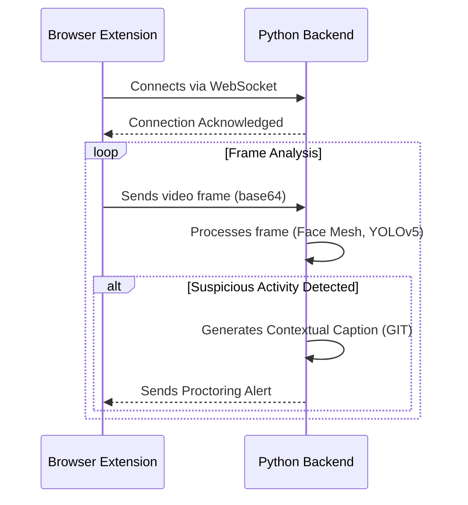

# AI Interview Proctor

This is a sophisticated, real-time proctoring tool designed as a browser extension for the **interviewer**. It integrates directly into Google Meet to automatically detect and flag potential cheating behaviors from the candidate's video feed.

The system provides live alerts in a discreet, draggable widget on the interviewer's screen, allowing for monitoring without disrupting the interview flow.

## Core Features

- **Interviewer-Focused:** The extension and widget run on the interviewer's machine, analyzing the candidate's video stream.
- **Live Cheating Detection:** Uses a pipeline of AI models to detect suspicious activities in real-time.
- **Face & Gaze Tracking (MediaPipe):** Detects if the candidate is looking away from the screen for an extended period.
- **Suspicious Object Detection (YOLOv5):** Identifies prohibited items like phones, books, or another person in the candidate's video frame.
- **Contextual Analysis (Microsoft GIT):** A lightweight, open-source model provides simple text descriptions of high-risk events (e.g., "a person looking at a cell phone").
- **On-Screen Alerts:** All alerts are displayed directly in the interviewer's meeting widget, color-coded by severity.
- **Fully Local & Open-Source:** The entire AI backend runs locally on your machine, requiring no external API keys or incurring any costs.

## System Architecture

A simple diagram illustrating the data flow:



## Setup and Installation

Follow these steps to get the project running.

### 1. Backend Setup

The backend requires Python 3.9+.

```bash
# 1. Navigate to the backend directory
cd backend

# 2. Create a Python virtual environment
# On Windows
python -m venv venv
# On macOS/Linux
python3 -m venv venv

# 3. Activate the virtual environment
# On Windows
.\venv\Scripts\activate
# On macOS/Linux
source venv/bin/activate

# 4. Install the required dependencies
pip install -r requirements.txt
```

### 2. Browser Extension Setup

These instructions are for Google Chrome, but are similar for other Chromium-based browsers.

1.  Open Chrome and navigate to `chrome://extensions`.
2.  Enable **Developer mode** using the toggle in the top-right corner.
3.  Click the **Load unpacked** button.
4.  Select the `extension` folder from this project directory.
5.  The "AI Proctor" extension should now appear in your list of extensions and in your browser's toolbar.

## How to Use

1.  **Start the Backend Server:**
    - Make sure your virtual environment is activated.
    - In the `backend` directory, run the server:
      ```bash
      python main.py
      ```
    - Wait for the log message indicating that the Uvicorn server is running.

2.  **Start Proctoring in Google Meet:**
    - Join a Google Meet call.
    - The AI Proctor widget will automatically appear on the screen.
    - Click the **"Start Monitoring"** button.
    - The backend terminal will show a `client connected` message, and the widget will display a 'System Connected' alert.
    - The system is now live and will send alerts to the widget if suspicious behavior is detected.

## Configuration

You can customize detection thresholds, model names, and cooldown periods by editing `backend/config.py`.

- `HEAD_YAW_THRESHOLD`: How far (in pixels) the candidate's head can turn before triggering a gaze check.
- `GAZE_ALERT_DELAY`: How long (in seconds) the candidate's gaze must be off-screen to trigger an alert.
- `YOLO_COOLDOWN`: Cooldown period (in seconds) between object detection alerts to prevent spam.

## Privacy & Ethics

This tool is designed for **interviewer use only** to maintain interview integrity. Users should:
- Inform candidates that proctoring is in use.
- Comply with all local privacy laws and regulations.
- Use alerts as indicators for further review, not as definitive proof of cheating.
- Manually review any flagged incidents.

## License

This project is open-source and available for educational and professional use.
